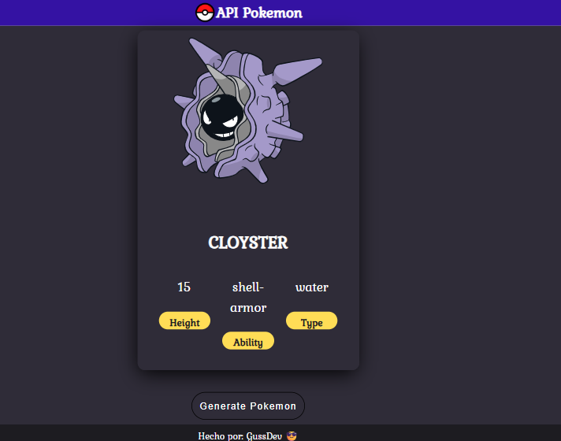

# 🧠 API Pokémon - Pokédex

Este proyecto es una Pokédex interactiva que utiliza la [PokéAPI](https://pokeapi.co/) para mostrar datos de Pokémon de forma dinámica. Al hacer clic en el botón "Generate Pokémon", se muestra información aleatoria de un Pokémon en una tarjeta.

## 🚀 Funcionalidades

- Mostrar un Pokémon aleatorio con cada clic.
- Diseño responsivo y atractivo.
- Uso de HTML, CSS y JavaScript puro.
- Integración con una API externa (PokéAPI).

## 📂 Estructura del Proyecto

- `index.html`: Estructura principal de la página.
- `style.css`: Estilos personalizados.
- `app.js`: Lógica para obtener y mostrar datos desde la API.
- `assets/`: Contiene el ícono de la Pokebola.

## 🖼️ Vista previa

